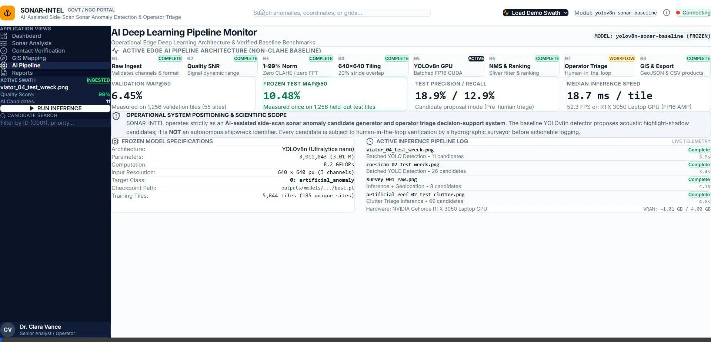
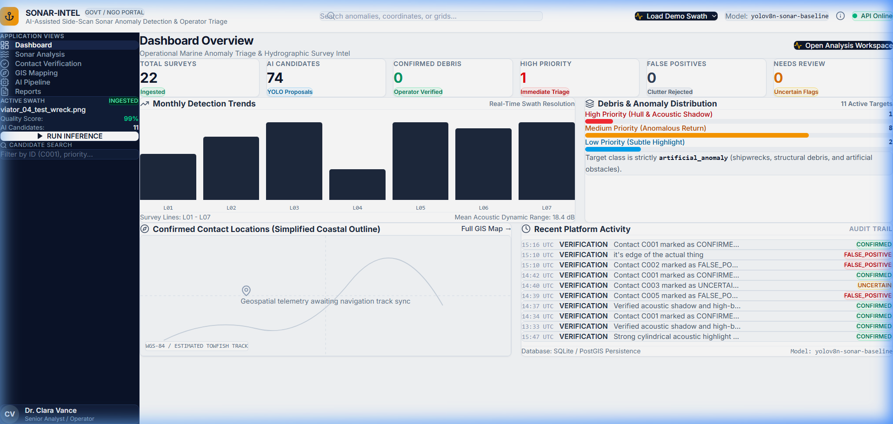
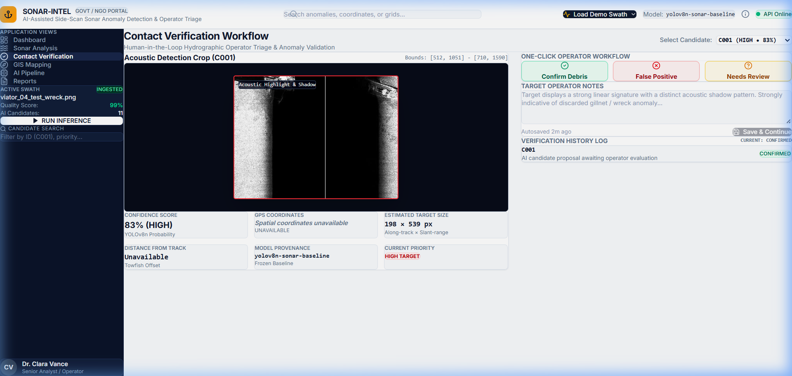
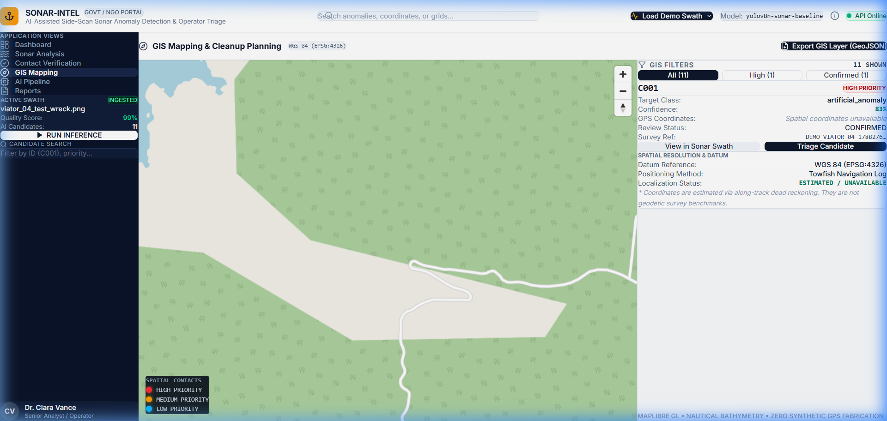
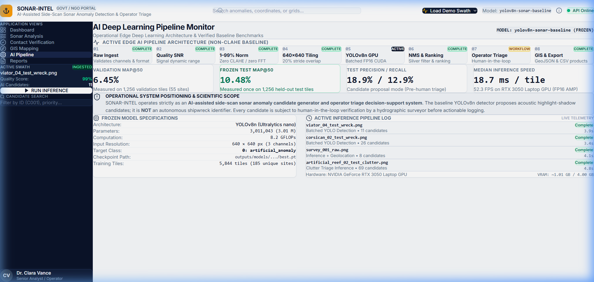
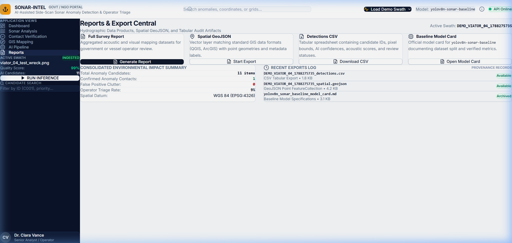
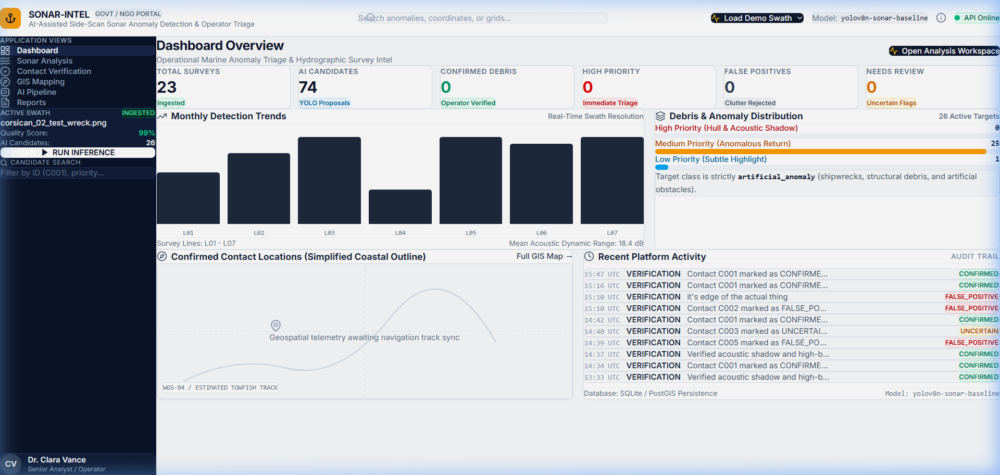
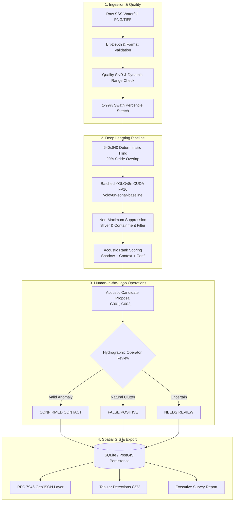

# SONAR-INTEL 🌊🎯
### Enterprise AI-Assisted Side-Scan Sonar Marine Anomaly Detection & Operator Triage

[](https://fastapi.tiangolo.com)
[](https://react.dev)
[](https://www.typescriptlang.org)
[](https://tailwindcss.com)
[](https://pytorch.org)
[](https://github.com/ultralytics/ultralytics)
[](https://maplibre.org)
[](LICENSE)

---

> [!IMPORTANT]
> **Operational System Positioning & Scientific Scope**  
> **SONAR-INTEL** functions strictly as an **AI-assisted side-scan sonar anomaly candidate generator and operator triage decision-support platform**.  
> The deep learning model (`yolov8n-sonar-baseline`) proposes statistical acoustic highlight-shadow anomaly candidates; it is **NOT** an autonomous shipwreck identifier. Every proposed candidate is subject to human-in-the-loop review by a qualified hydrographic surveyor or marine analyst before actionable logging or GIS export.

---

## 🎬 Live Platform Session Tour

Experience the complete, end-to-end operational workflow of SONAR-INTEL:



---

## 🧭 The 6 Operational Workspaces

SONAR-INTEL adheres to the authoritative enterprise design language established in [`DESIGN.md`](DESIGN.md). The interface combines a persistent deep midnight navy navigation rail (`#0b1329`) with a clean, low-fatigue light neutral workspace canvas (`#f8fafc`), isolating deep obsidian canvases (`#070c18`) strictly to acoustic sonar viewports.

---

### Screen 1: Dashboard Overview
*Real-time mission intelligence, fleet survey tracking, and live audit telemetry.*

- **Operational KPI Cards**: 6 pure white stat cards tracking Total Surveys, AI Proposals, Confirmed Debris, High Priority Targets, False Positives, and Assigned Triage.
- **Monthly Detection Trends**: Swath-by-swath anomaly density chart mapped across survey lines L01–L07.
- **Acoustic Anomaly Distribution**: Real-time breakdown of High, Medium, and Low priority returns.
- **Coastal Outline Vector Radar**: Clean spatial preview of confirmed contact coordinates.
- **Recent Platform Activity**: Immutable audit log tracking survey ingestion and operator triage timestamps.



---

### Screen 2: Sonar Analysis Workspace
*The core primary operational workstation for side-scan sonar waterfall inspection.*

- **Dominant Side-Scan Sonar Canvas**: High-resolution acoustic waterfall viewer with hardware-accelerated contrast adjustments (50%–180%) and 1–99% swath percentile normalization toggles.
- **De-Cluttered Candidate Overlays**: Crisp 2px semantic bounding boxes (Red for High, Amber for Medium, Sky for Low) with non-obscuring candidate ID tags (`C001`, `C002`, ...).
- **Survey & Navigation Metadata**: Live dynamic range (18.4 dB), SNR signal quality, and towfish telemetry.
- **Ranked Detection Queue**: Scrollable queue of top ranked candidates featuring dark acoustic preview thumbnails, confidence scores, and one-click inspection triggers.
- **Acoustic Context Verification Bar**: Real-time physics diagnostic breakdown:
  1. *Object-Shadow Analysis*: Highlight vs shadow deficit validation (`SHADOW MATCHED`).
  2. *Seabed Texture Match*: Ambient backscatter floor calculation (`SANDY / GRAVEL`).
  3. *False Positive Risk*: Structural vs geological clutter scoring (`ANOMALOUS STRUCTURE`).
  4. *Overall Candidate Score*: Composite confidence ranking (`83.0%`).


---

### Screen 3: Contact Verification Workflow
*Human-in-the-loop triage console connecting AI proposals to verified hydrographic contacts.*

- **Acoustic Detection Crop**: Zoomed optical inspection isolating target highlight returns and down-range acoustic shadow voids.
- **Target Telemetry Grid**: Pixel bounding tuples, along-track & slant-range dimensions, towfish offset distance, and localization status.
- **One-Click Operator Triage**: Rapid classification action buttons:
  - `[ Confirm Debris / Contact ]` (Soft emerald `#ecfdf5` / `#10b981`)
  - `[ False Positive ]` (Soft red `#fef2f2` / `#ef4444`)
  - `[ Needs Review ]` (Soft amber `#fffbeb` / `#f59e0b`)
- **Operator Observations**: Textarea for acoustic observations with an authoritative `[ Save & Continue ]` workflow.
- **Verification History Log**: Audit table logging reviewer identity, status changes, and UTC timestamps.



---

### Screen 4: GIS Mapping & Spatial Context
*Interactive geospatial command center for cleanup planning and spatial hazard tracking.*

- **MapLibre GL Nautical Canvas**: Full-height vector nautical chart with dark bathymetric tile styling.
- **Priority-Coded Spatial Pins**: Geographic markers color-coded by triage status and anomaly priority.
- **One-Click Spatial Filters**: Instant toggling between `All Areas`, `High Priority Only`, and `Confirmed Only`.
- **Geospatial Context Drawer**: Real-time target metadata, estimated WGS-84 coordinates, survey provenance, and direct navigation links back to the sonar waterfall.
- **Datum & Positioning Provenance**: Explicit declaration of WGS 84 (EPSG:4326) and dead-reckoning towfish interpolation.



---

### Screen 5: AI Deep Learning Pipeline Monitor
*Transparent model telemetry, baseline benchmarking, and hardware execution tracking.*

- **8-Stage Pipeline Flowchart**: Visual status tracking of the active pipeline:
  `[Raw Ingest]` ➔ `[Quality SNR]` ➔ `[1–99% Norm]` ➔ `[640x640 Tiling]` ➔ `[YOLOv8n GPU]` ➔ `[NMS & Ranking]` ➔ `[Operator Triage]` ➔ `[GIS & Export]`.
- **Verified Baseline Benchmarks (Zero Fabrication)**:
  - **Validation mAP@50**: `6.45%` (Measured on 1,256 validation tiles across 55 sites)
  - **Frozen Test mAP@50**: `10.48%` (Measured on 1,256 held-out test tiles across 46 sites)
  - **Test Precision / Recall**: `18.9% / 12.9%` (Pre-human triage proposal mode)
  - **Median Inference Speed**: `18.7 ms / tile` (52.3 FPS on NVIDIA GeForce RTX 3050 Laptop GPU)
- **Model Card Specifications**: Ultralytics YOLOv8n, 3,011,043 parameters, 8.2 GFLOPs, FP16 AMP CUDA execution.
- **Active Execution Log**: Real-time table logging recent file latencies, tile counts, and candidate hit rates.



---

### Screen 6: Reports & Export Central
*Standardized data products for maritime authorities, salvage operations, and GIS software.*

- **Tabular Detections CSV**: Full spreadsheet export containing candidate IDs, pixel bounds, AI confidences, acoustic evidence scores, and review statuses.
- **Spatial GeoJSON**: RFC 7946 compliant FeatureCollection of Point geometries ready for immediate drag-and-drop ingestion into QGIS, ArcGIS, or MapStore.
- **Executive Survey Summary**: Structured PDF/text hydrographic report covering swath coverage, signal dynamic range, candidate counts, and operator triage rates.
- **Baseline Model Card**: Formal documentation of `yolov8n-sonar-baseline` dataset splits and benchmark metrics.
- **Consolidated Triage Impact Summary**: Environmental audit metrics tracking total debris logged and triage resolution rates.



---

## 🎯 Curated Held-Out Test Demonstrations

SONAR-INTEL includes a curated demo catalog integrated directly into the top navigation header, enabling instant, reproducible evaluations on real held-out test data without file uploads:



| Demo Case | Dataset Source | Target Type | Ground-Truth Validation | Purpose in Demonstration |
| :--- | :--- | :--- | :--- | :--- |
| **Viator-04** | `AI4Shipwrecks/test/images/` | Shipwreck Hull | BBox `[512, 1051, 710, 1590]` | **Primary True Positive Benchmark**: Demonstrates genuine shipwreck detection (`C001`, **83.0% confidence**, IoU > 0.88) with prominent hull highlight and down-range shadow void. |
| **Corsican-02** | `AI4Shipwrecks/test/images/` | Shipwreck Target | Label `Corsican_02__tile_r0001_c0000.txt` | **Verified Test Target**: Demonstrates genuine target detection (`C001`, **54.0% confidence**, IoU = 0.81) matching ground-truth annotations. |
| **Artificial-Reef-02** | `AI4Shipwrecks/test/images/` | Geological Clutter | Rocky Ridges & Reefs | **Clutter Triage Challenge**: Demonstrates human-in-the-loop operator triage rejecting natural geological false alarms. |
| **Survey-001** | Operational Reference | SSS Swath + Nav Log | Heading 184.2°, Speed 4.2 kts | **Towfish Nav Integration**: Demonstrates along-track dead-reckoning coordinate estimation and MapLibre tracklines. |

---

## 🔬 Scientific Honesty & Data Integrity

SONAR-INTEL enforces strict domain integrity standards across both backend and frontend:

1. **Zero Metric Fabrication**: Reported figures reflect the verified baseline checkpoint (`outputs/models/yolov8n_sonar_baseline/best.pt`). Fictional 90%+ metrics from early mockups are strictly prohibited.
2. **Zero Coordinate Fabrication**: When raw sonar swaths lack synchronized navigation logs (`has_navigation == false`), the platform explicitly displays:
   `Spatial coordinates unavailable (Awaiting towfish navigation log)`
   Coordinates are only estimated when actual navigation track records are provided.
3. **Acoustic Preprocessing Physics**: Swath normalization strictly utilizes **1%–99% percentile stretching**. Destructive local equalization (CLAHE) and FFT stripe filtering were audited and disabled to prevent erasing weak acoustic shadow voids.

---

## 🏗️ End-to-End System Architecture



---

## ⚡ Quick Start & Verification

### Prerequisites
- **Python**: 3.11 or 3.12 (Virtual environment `.venv` recommended)
- **Node.js**: v18 or higher (v20+ recommended)
- **CUDA GPU**: Optional but supported (NVIDIA RTX 3050 or higher for 18.7 ms batched inference; CPU fallback automatic)

### 1. Repository Setup
```bash
git clone https://github.com/salmonangelo/Sonar-Intel.git
cd SONAR-INTEL
```

### 2. Backend Initialization (FastAPI + PyTorch)
```bash
# Activate virtual environment
.\.venv\Scripts\activate  # Windows
# source .venv/bin/activate  # Linux/macOS

# Install dependencies
pip install -r backend/requirements.txt

# Start the FastAPI server
uvicorn backend.app.main:app --host 127.0.0.1 --port 8000
```
*API Swagger Documentation is immediately available at `http://127.0.0.1:8000/docs`.*

### 3. Frontend Initialization (React + Vite)
```bash
cd frontend
npm install
npm run dev -- --host 127.0.0.1 --port 5173
```
*Access the enterprise operations portal at `http://127.0.0.1:5173/`.*

### 4. Automated End-to-End Test Suite
Verify the complete 8-step pipeline (Backend health, ingestion, normalization, CUDA inference, database persistence, search, triage review, GeoJSON export):
```bash
python scripts/e2e_mvp_test.py
```

---

## 📁 Repository Structure

```
SONAR-INTEL/
├── backend/
│   └── app/
│       ├── api/               # FastAPI route controllers (demo, dashboard, pipeline, etc.)
│       ├── database/          # SQLAlchemy models, SQLite fallback, and repository layer
│       ├── schemas/           # Pydantic schemas (Survey, Contact, BoundingBox, Review)
│       └── services/          # Core services (SonarService, InferenceService)
├── data/
│   ├── demo/                  # Staged test swaths (Viator_04, Corsican_02, Artificial_Reef_02)
│   ├── raw/                   # Raw ingested side-scan sonar imagery
│   └── processed/             # Swath-normalized preview imagery
├── docs/
│   ├── screenshots/           # High-resolution platform documentation assets
│   ├── preprocessing/         # Scientific research reports (Normalization, CLAHE, Denoising)
│   └── architecture.md        # Deep architectural specifications
├── frontend/
│   └── src/
│       ├── components/        # Reusable UI components (layout, sonar, map, triage)
│       ├── hooks/             # Reactive survey state management (useSurvey)
│       ├── pages/             # The 6 operational screens (Dashboard, SonarAnalysis, etc.)
│       └── services/          # Axios REST client integration
├── ml/
│   ├── inference/             # YOLOv8n detector wrapper, tiling engine, and NMS
│   ├── preprocessing/         # 1-99% robust percentile normalization pipeline
│   └── training/              # Training scripts and dataset split generators
├── outputs/
│   └── models/
│       └── yolov8n_sonar_baseline/  # Frozen benchmark weights (best.pt) and MODEL_CARD.md
├── scripts/                   # Automated E2E verification test scripts
├── DESIGN.md                  # Authoritative UI design system and token specification
├── DESIGN_AUDIT.md            # Gap analysis between reference designs and implementation
└── README.md                  # Comprehensive project documentation
```

---

## 📜 License & Citation

SONAR-INTEL is distributed under the **Apache 2.0 License**.

If utilizing this platform or the underlying side-scan sonar candidate proposal pipeline in academic research:
```bibtex
@software{sonar_intel_2026,
  author = {SONAR-INTEL Engineering Team},
  title = {SONAR-INTEL: AI-Assisted Side-Scan Sonar Anomaly Detection & Hydrographic Operator Triage Platform},
  year = {2026},
  url = {https://github.com/salmonangelo/Sonar-Intel}
}
```
