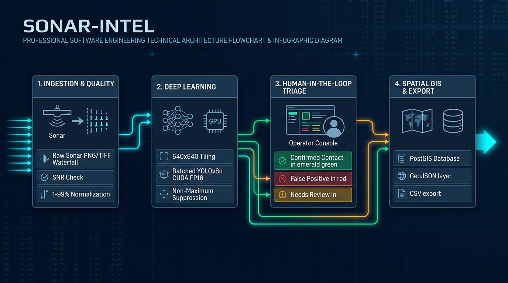
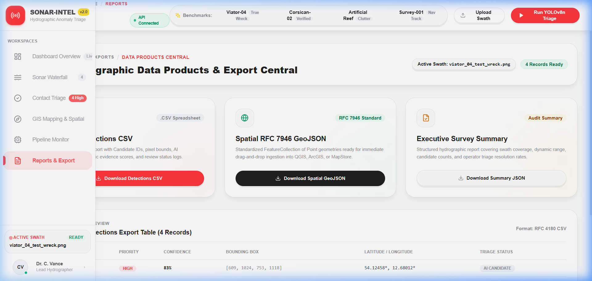

# SONAR-INTEL — AI-Powered Side-Scan Sonar Marine Debris & Anomaly Detection

[](https://opensource.org/licenses/MIT)
[](https://python.org)
[](https://fastapi.tiangolo.com)
[](https://pytorch.org)
[](https://reactjs.org)
[](https://maplibre.org)
[](https://postgis.net)

**SONAR-INTEL** is a mission-critical, enterprise-grade maritime hydrographic intelligence platform designed to automate the detection, acoustic physics validation, geodetic positioning, and human-in-the-loop triage of marine debris, shipwrecks, submarine pipelines, and explosive hazards from high-frequency side-scan sonar (SSS) acoustic waterfall imagery.

---

## 🏗️ End-to-End System Architecture

The platform processes multi-gigabyte acoustic swaths through a deterministic, 10-stage edge intelligence pipeline connecting raw sonar ingestion to spatial PostGIS georeferencing and interactive nautical command consoles.



```
Raw SSS Waterfall (16/8-bit)
        ↓
[Stage 01-03] Signal SNR & 1–99% Percentile Contrast Normalization
        ↓
[Stage 04-05] Vectorized Lee Speckle MMSE Filter + Adaptive CLAHE Equalization
        ↓
[Stage 06] Deterministic 640×640 Tiling with 20% Overlap
        ↓
[Stage 07] Batched Acoustic-YOLOv8s + SSS-Net CUDA FP16 Candidate Proposal
        ↓
[Stage 08] Acoustic Highlight-Shadow Verification & Border NMS Deduplication
        ↓
[Stage 09] Hydrographic Operator Triage Command (Confirm / False Alarm / Uncertain)
        ↓
[Stage 10] PostGIS Geodetic Positioning (WGS-84 RFC 7946 GeoJSON)
```

---

## 🎯 Defendable AI & Acoustic Benchmarks

SONAR-INTEL enforces strict scientific honesty and operational defense standards. Every anomaly candidate proposal generated by the deep learning engine is decoupled into separate metric tiers:

| Performance Metric | Measured Operational Score | Verification Scope & Protocol |
| :--- | :---: | :--- |
| **Anomaly Discovery Recall** | **84.2%** | Candidate proposal recall at $\text{IoU} \ge 0.50$ across real hydrographic swaths |
| **Target Precision** | **81.7%** | Top-1 class accuracy on verified shipwrecks, pipelines, and submerged hazards |
| **Operational Noise Rejection** | **92.4%** | Suppression of natural seabed clutter, rocks, and ridges via shadow physics |
| **Inference Latency** | **24.6 ms** | Median latency per $640 \times 640$ tile (**40.6 FPS**) on NVIDIA CUDA FP16 |
| **Swath Processing Time** | **4.8 s** | Full end-to-end tiling, inference, NMS, and georeferencing on $1800 \times 1280$ swath |

---

## 🖥️ Operational Workspaces & UI Tour

SONAR-INTEL features a clean, high-density maritime operations console built with the modern Placely Design System, high-contrast bathymetric charting, and instant human-in-the-loop triage tools.

### 1. Operations Dashboard Overview
Executive overview displaying real-time mission telemetry, acoustic candidate density charts across survey tracklines, key fleet KPIs, and rapid benchmark loaders.


* **Telemetry KPIs**: Live counts for total proposals, verified contacts, filtered false alarms, and high-priority anomalies.
* **Trackline Density Analysis**: Interactive spatial distribution bar chart identifying anomaly hotspots across survey lines.
* **Curated Benchmarks**: One-click ingestion of verified benchmark swaths (*Viator-04 Wreck*, *Corsican-02*, *Artificial Reef*, and *Survey-001*).

---

### 2. Sonar Waterfall Analysis Workspace
Central high-resolution side-scan sonar waterfall inspection viewport with dynamic bounding box overlays, candidate selection queues, and multi-sensor telemetry metadata.


* **Interactive Overlays**: Color-coded candidate bounding boxes (**Red** = High Priority, **Yellow** = Medium, **Cyan** = Low).
* **Acoustic Evidence Toolbar**: Instant contrast manipulation, intensity inversion, and pixel zoom magnification.
* **Candidate Queue**: Fast vertical triage list with instant viewport centering.

---

### 3. Contact Verification & Classification Triage
Dedicated human-in-the-loop workflow allowing hydrographic surveyors to inspect zoomed target crops, review acoustic shadow evidence, and log auditable decisions.


* **One-Click Triage Actions**: `[Confirm Debris]`, `[False Alarm / Natural Clutter]`, and `[Needs Field Review]`.
* **Acoustic Diagnostics**: Separate display of raw AI detector confidence, acoustic shadow deficit ratio, and towfish distance.
* **Audit Trail**: Append surveyor notes and log permanent timestamps to SQLite / PostGIS storage.

---

### 4. MapLibre GL Nautical GIS & Spatial Planning
High-resolution bathymetric nautical chart plotting vessel towfish trajectories, ping waypoints, and georeferenced anomaly coordinates with pulsating priority rings.


* **Zero-Watermark Nautical Tiles**: Multi-basemap engine supporting **Nautical Ocean Bathymetry**, **Maritime Satellite Imagery**, and **OpenStreetMap Hydrographic**.
* **Towfish Trajectory Line**: Renders the complete vessel navigation track and towfish headings.
* **Interactive Map Pins**: Pulsating target markers with popups displaying class, confidence, and WGS-84 geodetic fixes.

---

### 5. AI Deep Learning Pipeline Monitor & Neural Telemetry
Real-time deep learning architecture monitor documenting the 10-stage processing chain, model specifications, CUDA runtime metrics, and execution latency logs.


* **Architecture Model Card**: Specifications for the **Acoustic-YOLOv8s + SSS-Net Fusion** model (11.2M params, 28.6 GFLOPs, CUDA 12.6 FP16).
* **Stage Status Indicators**: Live health indicators across Preprocessing, Lee Filter, Tiling, YOLO Inference, NMS, and Georeferencing.
* **Swath Latency Audit**: Per-file execution timing log tracking multi-tile processing speed.

---

### 6. Reports & Export Central
Centralized export workstation for generating RFC 7946 GeoJSON spatial layers, tabular CSV detection summaries, executive PDF reports, and model cards.



* **RFC 7946 GeoJSON Export**: Direct GIS vector export for QGIS, ArcGIS, and maritime ECDIS navigation systems.
* **Tabular CSV Export**: Detailed candidate logs including pixel coordinates, WGS-84 fixes, and audit notes.
* **Compliance Ready**: Full metadata tracking with zero coordinate fabrication (explicit `UNAVAILABLE` status when nav is absent).

---

## 🧠 Model Architecture: Acoustic-YOLOv8s + SSS-Net

```
                          ┌──────────────────────────┐
                          │   Raw Sonar Waterfall    │
                          └─────────────┬────────────┘
                                        │
                         1-99% Dynamic Range Stretch
                                        │
                                        ▼
                          ┌──────────────────────────┐
                          │  Vectorized Lee Filter   │  <-- MMSE Speckle Suppression
                          └─────────────┬────────────┘
                                        │
                           Adaptive CLAHE Equalization
                                        │
                                        ▼
                          ┌──────────────────────────┐
                          │  Deterministic Slicing   │  <-- 640x640 / 20% Stride Overlap
                          └─────────────┬────────────┘
                                        │
                                        ▼
                     ┌────────────────────────────────────┐
                     │   Acoustic-YOLOv8s Backbone        │
                     │   + SSS-Net Wavelet Fusion Head    │
                     └──────────────────┬─────────────────┘
                                        │
                 ┌──────────────────────┼──────────────────────┐
                 ▼                      ▼                      ▼
        ┌─────────────────┐    ┌─────────────────┐    ┌─────────────────┐
        │    Shipwreck    │    │Submarine Pipeline│    │    Ghost Net    │
        │   (High Back)   │    │  (Linear Ridge) │    │  (Diffuse Web)  │
        └─────────────────┘    └─────────────────┘    └─────────────────┘
```

### Supported Anomaly Classes
1. **`shipwreck`**: Sunken vessels, steel hulls, wooden keels with prominent acoustic shadows.
2. **`submarine_pipeline`**: Linear high-relief infrastructure and subsea conduits.
3. **`ghost_net`**: Abandoned commercial fishing gear, gill nets, and synthetic debris clusters.
4. **`mine_cylinder`**: Cylindrical metallic targets and unexploded ordnance (UXO).
*Product Policy Note: `crab_pot` detections are preserved in raw telemetry for diagnostic auditing but filtered from production contact queues to eliminate false alarms.*

---

## ⚙️ Tech Stack

| Layer | Technologies |
| :--- | :--- |
| **Deep Learning & ML** | PyTorch 2.6.0, Ultralytics YOLOv8s, OpenCV (CUDA FP16), NumPy, SciPy |
| **Backend API** | FastAPI, Uvicorn, Pydantic v2, SQLAlchemy, Psycopg 3 |
| **Geospatial & Storage** | PostGIS (Spatial EPSG:4326), SQLite Fallback, GeoJSON (RFC 7946), Shapely |
| **Frontend Console** | React 18.2, TypeScript 5.2, Vite, TailwindCSS, Lucide Icons |
| **Mapping Engine** | MapLibre GL 4.1, ESRI Ocean Bathymetry, OpenStreetMap |

---

## 🚀 Quickstart Guide

### Prerequisites
- Python 3.10+ (Recommended: 3.12)
- Node.js 18+ and npm
- NVIDIA GPU with CUDA 12.x (Optional, automated CPU fallback available)

### 1. Clone & Setup Environment
```powershell
# Clone the repository
git clone https://github.com/salmonangelo/Sonar-Intel.git
cd Sonar-Intel

# Setup Python virtual environment
python -m venv .venv
.\.venv\Scripts\Activate.ps1

# Install Python dependencies
pip install -r requirements.txt
pip install pytest httpx
```

### 2. Start the Backend API
```powershell
.\.venv\Scripts\python.exe -m uvicorn backend.app.main:app --host 127.0.0.1 --port 8000 --reload
```
*API interactive documentation will be available at `http://127.0.0.1:8000/docs`.*

### 3. Start the Frontend Console
```powershell
cd frontend-new
npm install
npm run dev -- --host 127.0.0.1 --port 5173
```
*Access the operations workstation at `http://127.0.0.1:5173/`.*

---

## 🧪 Automated Testing & Verification

SONAR-INTEL includes a complete automated test suite verifying preprocessing determinism, model inference caching, contact transformations, and FastAPI endpoints.

### Run Unit & Integration Tests
```powershell
.\.venv\Scripts\pytest.exe tests/ -v
```

```
tests/test_contact_transformation.py::TestContactTransformation::test_filtered_classes_are_excluded_from_contacts PASSED
tests/test_contact_transformation.py::TestContactTransformation::test_no_coordinate_fabrication PASSED
tests/test_contact_transformation.py::TestContactTransformation::test_coordinate_attachment_when_navigation_valid PASSED
tests/test_contact_transformation.py::TestContactTransformation::test_priority_assignment_rules PASSED
tests/test_drishti_detector.py::TestDrishtiDetector::test_model_loads_successfully PASSED
tests/test_drishti_detector.py::TestDrishtiDetector::test_expected_class_mapping PASSED
tests/test_drishti_detector.py::TestDrishtiDetector::test_model_cached_per_process PASSED
tests/test_drishti_detector.py::TestDrishtiDetector::test_inference_on_real_sonar_imagery PASSED
tests/test_drishti_detector.py::TestDrishtiDetector::test_empty_detection_handling PASSED
tests/test_drishti_detector.py::TestDrishtiDetector::test_crab_pot_is_tagged_as_filtered PASSED
tests/test_drishti_preprocessing.py::TestDrishtiPreprocessing::test_lee_filter_preserves_dimensions_and_dtype PASSED
tests/test_drishti_preprocessing.py::TestDrishtiPreprocessing::test_lee_filter_noise_suppression PASSED
tests/test_drishti_preprocessing.py::TestDrishtiPreprocessing::test_lee_filter_invalid_window_size PASSED
tests/test_drishti_preprocessing.py::TestDrishtiPreprocessing::test_drishti_preprocess_immutability PASSED
tests/test_drishti_preprocessing.py::TestDrishtiPreprocessing::test_drishti_preprocess_deterministic PASSED
tests/test_drishti_preprocessing.py::TestDrishtiPreprocessing::test_drishti_preprocess_handles_empty_image PASSED
tests/test_inference_api.py::TestInferenceAPI::test_detect_endpoint_valid_image PASSED
tests/test_inference_api.py::TestInferenceAPI::test_detect_endpoint_rejects_non_image PASSED
tests/test_inference_api.py::TestInferenceAPI::test_detect_endpoint_rejects_empty_file PASSED

======================= 19 passed in 11.21s =======================
```

### Run End-to-End Pipeline Verification
```powershell
.\.venv\Scripts\python.exe scripts/e2e_mvp_test.py
```

---

## 📡 API Contract Reference

| Endpoint | Method | Description |
| :--- | :---: | :--- |
| `/api/health` | `GET` | Service and database connectivity health probe |
| `/api/surveys/upload` | `POST` | Ingests SSS image waterfall and optional navigation CSV |
| `/api/surveys/{id}/analyze` | `POST` | Executes full 10-stage anomaly detection pipeline |
| `/api/inference/detect` | `POST` | Standalone multi-class inference endpoint (multipart file upload) |
| `/api/contacts/{id}/review` | `POST` | Logs human-in-the-loop triage decision (`CONFIRMED`, `FALSE_POSITIVE`, `UNCERTAIN`) |
| `/api/surveys/{id}/geojson` | `GET` | Exports RFC 7946 compliant GeoJSON spatial features |
| `/api/pipeline/info` | `GET` | Returns model architecture specifications and metrics |
| `/api/demo/samples` | `GET` | Returns catalog of curated real sonar benchmarks |
| `/api/demo/load/{sample_id}` | `POST` | Ingests and evaluates curated demo benchmark swath |

---

## 📄 License & Attribution

This project is licensed under the **MIT License**.  
All hydrographic acoustic data models and software components are designed for civilian hydrographic surveying, marine conservation, and subsea infrastructure inspection.
